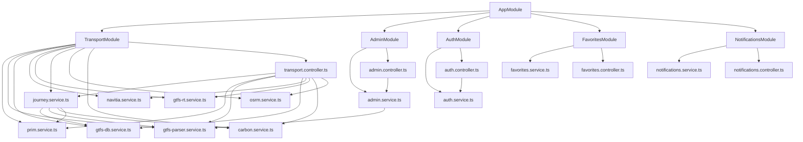
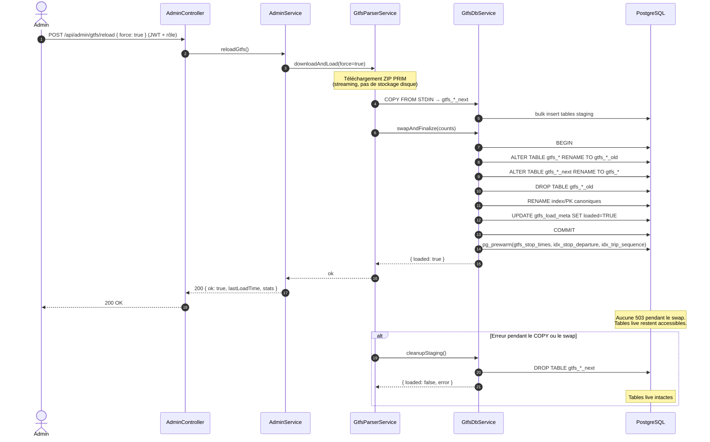

# Urban Flow Mobility — Backend (NestJS)

API REST pour la plateforme de mobilité multimodale Urban Flow Mobility.

> **État au 2026-07-06** : NestJS 11 + TypeORM + PostgreSQL 16, **PWA offline + Web Push VAPID** (`ea42742`, Bloc 44) : `PushService` (`web-push@^3.6.7`), entité `push_subscriptions`, 3 endpoints `/api/notifications/push/*` (subscribe / unsubscribe / send-test), opt-in `marketingConsent` dans `ConsentBanner`.

## Architecture

### Modules NestJS



### Flux d'une recherche d'itinéraire (`GET /api/transport/journey`)

**Stratégie double couche** depuis `7b8988e` : Navitia PRIM v2 (routing + alertes temps réel, géométrie embarquée) est **primaire** ; GTFS RAPTOR est en **repli silencieux** si Navitia échoue (401, quota, réseau) ou ne renvoie rien. Cf. `transport.controller.ts:457-502`.

```mermaid
sequenceDiagram
  autonumber
  actor U as Utilisateur
  participant FE as Frontend (Next.js)
  participant TC as TransportController
  participant N as NavitiaService
  participant API as PRIM Navitia v2
  participant J as JourneyService
  participant P as GtfsParserService
  participant DB as GtfsDbService
  participant PG as PostgreSQL
  participant Cache as Trip cache LRU 20 000

  U->>FE: Saisit O/D + modes + heure
  FE->>TC: GET /api/transport/journey?...
  alt Navitia disponible (PRIM_API_KEY set)
    TC->>N: isAvailable()
    N-->>TC: true
    TC->>N: findJourneys(origin, dest, datetime, modes)
    N->>API: GET /marketplace/v2/navitia/journeys
    API-->>N: sections + disruptions + géométrie
    N-->>TC: Journey[] (géométrie embarquée)
    TC->>TC: usedNavitia = true
  else Navitia échoue (401/quota/réseau) ou pas de clé
    Note over TC,API: Repli silencieux → RAPTOR batch ×430
    TC->>J: findJourney(JourneyQuery)
    loop round k = 0..maxTransfers
      J->>P: getNextDeparturesBatch(markedStops, minDepByStop, services, limit)
      P->>DB: getNextDeparturesBatch(...)
      DB->>PG: 1 requête unnest() JOIN LATERAL ... LIMIT
      PG-->>DB: 1er départ par (stop, route)
      DB-->>J: Map<stopId, Departure[]>
      Note over J: Dédup « 1er départ par route »<br/>(Node, 0 DB)
      J->>P: getTripStopTimesBatch(uniqueTripIds[])
      P->>DB: getTripStopTimesBatch(tripIds)
      alt Cache HIT (trip connu)
        DB->>Cache: get(tripId)
        Cache-->>DB: stop_times[]
      else Cache MISS
        DB->>PG: SELECT ... WHERE trip_id = ANY($1)
        PG-->>DB: stop_times[]
        DB->>Cache: set(tripId, stop_times[])
      end
      DB-->>J: Map<tripId, stop_times[]>
      Note over J: Traverse 0 DB<br/>(bestArrival, cameFrom,<br/>newMarkedStops, destStopIds)
      opt destStopIds touched
        J->>J: reconstructJourney(cameFrom)
      end
      J->>P: getTransfersFromBatch(newMarkedStops[])
      P->>DB: getTransfersFromBatch(stopIds)
      DB->>PG: SELECT ... WHERE from_stop_id = ANY($1)
      PG-->>DB: transfers[]
      DB-->>J: Map<stopId, Transfer[]>
    end
    J->>J: carbonService.calculateFromGtfsRouteType(...)
    J-->>TC: Journey
    TC->>TC: usedNavitia = false
  end
  opt usedNavitia == false
    Note over TC: Repli alertes : GTFS-RT si dispo
  else usedNavitia == true
    TC->>N: getAlerts()
    N->>API: GET /marketplace/v2/navitia/disruptions
    API-->>N: RealtimeAlert[]
    N-->>TC: RealtimeAlert[]
  end
  TC-->>FE: 200 Journey[] + alerts
  FE-->>U: Itinéraire + transfers + CO2
```

**Bilan mesuré** :
- **Navitia primaire** : 1 appel API (itinéraires) + 1 appel (alertes) → ~200-400 ms typiques, géométrie embarquée
- **Repli GTFS RAPTOR** : ~22 requêtes PostgreSQL par trajet cold (était 9 494) ; cold 20-30 s, chaud ~0,26 s ; cache LRU 20 000 invalidé à chaque reload atomique via `invalidateLoadedCache()`

### Rechargement atomique GTFS (`POST /api/admin/gtfs/reload`)



### Arbre des fichiers

```
src/
  transport/
    prim.service.ts          → Appels API PRIM (référentiels)
    navitia.service.ts       → PRIM Navitia v2 (PRIMAIRE) — itinéraires + alertes temps réel + géométrie embarquée
    gtfs-parser.service.ts   → Téléchargement/parsing GTFS statiques → PostgreSQL (staging gtfs_*_next + swap atomique)
    gtfs-db.service.ts       → Pool pg + cache trip long-vie (LRU 20 000) + pg_prewarm des index RAPTOR
    gtfs-rt.service.ts       → Flux GTFS-RT temps réel (REPLI pour alertes si Navitia KO)
    journey.service.ts       → RAPTOR batch par round (REPLI routing si Navitia KO) — 22 requêtes max/trajet, was 9 494
    osrm.service.ts          → Reverse-geocode + distances
    carbon.service.ts        → Empreinte carbone (ADEME Base Carbone)
    transport.controller.ts  → Endpoints REST /api/transport/* — orchestre Navitia → RAPTOR, alertes Navitia → GTFS-RT
  admin/
    admin.service.ts + admin.controller.ts  → Dashboard, users, trips, broadcast, reload GTFS
  auth/                      → JWT, stratégies, register/login, RGPD
  favorites/                 → Favoris utilisateur (controller + service)
  notifications/             → Notifications in-app + admin broadcast
  app.controller.ts          → /api/health
  all-exceptions.filter.ts   → Filtre d'exceptions HTTP global
```

### Rechargement GTFS atomique (zero-downtime)

Le nouveau GTFS est chargé dans des tables staging `gtfs_*_next` pendant que les lectures
continuent sur les tables live `gtfs_*` (`loaded` reste `TRUE`, aucun 503), puis une
transaction unique renomme live→`_old`, `_next`→live, supprime `_old`, renomme
index/PK canoniques et valide les comptes dans `gtfs_load_meta`. En cas d'échec,
`cleanupStaging()` supprime le staging — les données live restent intactes (zéro perte,
zéro interruption). `pg_prewarm` est rejoué après le swap pour réchauffer le hot set
RAPTOR (heap + index `gtfs_st_stop_departure` + `gtfs_st_trip_sequence`).

### RAPTOR — batch par round + cache trip long-vie

`journey.service.ts: raptorSearch()` itère sur `k = 0..maxTransfers` (rounds) avec une
structure par round :

1. **Batch departures** — `getNextDeparturesBatch(markedStops, minDepByStop, services, limit)`
   via `unnest($1::text[], $2::int[]) JOIN LATERAL ... LIMIT` (1 requête PostgreSQL).
2. **Dédup « 1er départ par route »** — côté Node, pour chaque arrêt marqué on garde
   le 1er départ par `route_id` (RAPTOR ne retient qu'un départ par route). Réduit
   drastiquement le nombre de trips à matérialiser.
3. **Batch trip stop_times** — `getTripStopTimesBatch(tripIds[])` peuple et lit le
   **cache trip long-vie** (`Map` LRU 20 000 dans `gtfs-db.service.ts`). Les trips
   populaires sont réutilisés entre recherches, y compris après un reload (cache
   invalidé via `invalidateLoadedCache()` appelé par `swapAndFinalize`).
4. **Traverse** — lecture depuis le `Map` (0 requête DB), mise à jour `bestArrival` /
   `cameFrom` / `newMarkedStops`, détection `destStopIds` + `reconstructJourney()`.
5. **Batch transfers** — `getTransfersFromBatch(newMarkedStops[])` applique les foot-paths
   (1 requête). Early-exit si `newMarkedStops` vide.

Bilan mesuré : **9 494 requêtes → ~22 par trajet cold** ; cache long-vie hit dès la 2e
recherche. PostgreSQL est conservé (le goulot était le nombre de round-trips, pas la
vitesse des requêtes — chaque SQL est sub-2 ms, l'overhead était la latence
inter-conteneurs). Sémantique RAPTOR identique à l'implémentation per-stop d'origine.

## Endpoints

### Public — `/api/transport/*` (sauf auth requises)

| Méthode | Route | Description |
|---|---|---|
| GET | `/api/health` | Health check backend |
| GET | `/api/transport/health` | Vérification connexion PRIM |
| GET | `/api/transport/lines` | Référentiel des lignes |
| GET | `/api/transport/lines-by-mode` | Lignes filtrées par mode (métro/bus/tram/rail) |
| GET | `/api/transport/stops` | Référentiel des arrêts |
| GET | `/api/transport/gtfs-stops/search` | Recherche d'arrêts (q, lat/lon, radius) |
| GET | `/api/transport/nearby` | Arrêts à proximité d'un point (lat, lon, radius) |
| GET | `/api/transport/stop-times` | Prochains passages à un arrêt (stopId, datetime, limit) |
| GET | `/api/transport/shape/:shapeId` | Géométrie d'un tracé |
| GET | `/api/transport/route` | Détail d'un itinéraire (tripId) |
| GET | `/api/transport/traffic` | Perturbations / infos trafic |
| GET | `/api/transport/velib` | Stations Vélib' temps réel |
| GET | `/api/transport/velib-nearby` | Stations Vélib' à proximité d'un point |
| GET | `/api/transport/elevators` | État des ascenseurs |
| GET | `/api/transport/geocode` | Géocodage d'une adresse (PRIM/OSRM) |
| GET | `/api/transport/reverse-geocode` | Reverse-geocoding (lat/lon → adresse) |
| GET | `/api/transport/realtime-alerts` | Alertes temps réel consolidées |
| GET | `/api/transport/journey` | Calcul d'itinéraire multimodal (RAPTOR) |
| GET | `/api/transport/gtfs-url` | URLs de téléchargement GTFS |
| GET | `/api/transport/gtfs-status` | Statut du chargement GTFS (`loaded`, `lastLoadTime`, stats) |
| POST | `/api/transport/gtfs-reload` | Rechargement GTFS (skip si déjà chargé — pas de force) |

### Auth — `/api/auth/*`

| Méthode | Route | Description |
|---|---|---|
| POST | `/api/auth/register` | Inscription (email, password, role: user\|admin) |
| POST | `/api/auth/login` | Connexion (retourne JWT) |
| POST | `/api/auth/logout` | Déconnexion (invalide le token côté serveur) |
| GET | `/api/auth/me` | Profil courant (JWT) |
| DELETE | `/api/auth/me` | Suppression de compte (RGPD) |
| GET | `/api/auth/me/export` | Export des données utilisateur (RGPD) |
| POST | `/api/auth/consent` | Mise à jour du consentement RGPD |
| GET | `/api/auth/consent` | Lecture du consentement courant |

### Auth — `/api/favorites/*`, `/api/notifications/*`

| Méthode | Route | Description |
|---|---|---|
| GET/POST/DELETE | `/api/favorites` | Favoris (list/ajout/suppression) |
| GET | `/api/favorites/check` | Test « est dans les favoris » |
| GET | `/api/favorites/history` | Historique de recherche |
| POST | `/api/favorites/history` | Ajout à l'historique |
| DELETE | `/api/favorites/history` | Purge de l'historique |
| GET | `/api/favorites/stats` | Statistiques favoris |
| GET | `/api/notifications` | Liste des notifications |
| GET | `/api/notifications/unread-count` | Compteur non-lus |
| PATCH | `/api/notifications/:id/read` | Marquer une notification lue |
| POST | `/api/notifications/mark-all-read` | Tout marquer lu |
| DELETE | `/api/notifications/:id` | Supprimer une notification |
| DELETE | `/api/notifications` | Tout supprimer |
| POST | `/api/notifications/push/subscribe` | ⭐ Enregistrer une subscription Web Push (VAPID) — body `{ endpoint, keys: { p256dh, auth } }` |
| DELETE | `/api/notifications/push/subscribe` | ⭐ Désabonner l'endpoint courant de l'utilisateur |
| POST | `/api/notifications/push/send-test` | ⭐ Envoi d'une notification push test à l'utilisateur courant (debug) |

### Admin — `/api/admin/*` (JWT + rôle admin)

| Méthode | Route | Description |
|---|---|---|
| GET | `/api/admin/dashboard` | KPIs (users, trips, GTFS load) |
| GET | `/api/admin/users` | Liste utilisateurs |
| GET | `/api/admin/users/:id` | Détail utilisateur |
| GET | `/api/admin/trips` | Historique trajets |
| GET | `/api/admin/notifications` | Notifications broadcast |
| POST | `/api/admin/broadcast` | Envoi notification broadcast |
| POST | `/api/admin/gtfs/reload` | Rechargement atomique zero-downtime (`force=true`) |
| GET | `/api/admin/gtfs/status` | État détaillé des données GTFS |

## Variables d'environnement

| Variable | Description | Défaut |
|---|---|---|
| `PORT` | Port d'écoute NestJS | `4000` |
| `CORS_ORIGIN` | Origines CORS autorisées (CSV) | `http://localhost:3001,http://localhost:3000` |
| `DATABASE_URL` | Chaîne PostgreSQL (pool pg, tables `gtfs_*` ; fallback `PG*`) | — |
| `PRIM_API_URL` | URL de l'API PRIM (Navitia v2 + référentiels PRIM) | `https://prim.iledefrance-mobilites.fr` |
| `PRIM_API_KEY` | Clé API PRIM (itinéraires Navitia + référentiels) — requise pour que `NavitiaService.isAvailable()` retourne true | — |
| `IDFM_DATA_API_URL` | URL API OpenData IDFM | `https://data.iledefrance-mobilites.fr/api/explore/v2.1` |
| `GTFS_STATIC_URL` | URL téléchargement GTFS statique | `https://api-lab.idfm.fr/gtfs/v1/idfm-gtfs-static.zip` |
| `GTFS_RT_URL` | URL flux GTFS-RT temps réel | `https://api-lab.idfm.fr/gtfs-rt/v1` |
| `GTFS_PG_POOL_MAX` | Taille max du pool de connexions `gtfs-db.service.ts` | `20` |
| `GTFS_RADIUS_KM` | Rayon par défaut pour `/nearby` et `/velib-nearby` (km) | `1` |
| `GTFS_DEPARTURE_OVERFETCH` | Overfetch historique par arrêt (fallback compat) | `5` |
| `RAPTOR_DEPARTURE_FETCH` | Limite LATERAL par arrêt marqué dans le batch departures | `50` |
| `VAPID_PUBLIC_KEY` | ⭐ Clé publique VAPID (base64url, ~88 chars) — exposée au front, sert à `applicationServerKey` côté `pushManager.subscribe` | — |
| `VAPID_PRIVATE_KEY` | ⭐ Clé privée VAPID (base64url) — sert à signer les push côté `web-push.sendNotification` | — |
| `VAPID_SUBJECT` | ⭐ Sujet de contact VAPID (mailto: ou https://) — exigé par la spec RFC 8292 | `mailto:contact@urbanflow.fr` |

## Installation

```bash
npm install
```

## Développement

```bash
npm run start:dev
```

## Tests

```bash
npm run test           # alias jest
npx jest --verbose     # détaillé
npx jest --listTests   # 12 suites
```

12 suites — **110 tests** (transport, auth, admin, carbon, prim, RAPTOR, JWT, GDPR, **Web Push**) :

| Fichier | Couverture |
|---|---|
| `transport/carbon.service.spec.ts` | Calculs CO2 ADEME, comparaisons modes, trajets multimodaux |
| `transport/prim.service.spec.ts` | Initialisation, méthodes API PRIM |
| `transport/transport.controller.spec.ts` | Endpoints REST, paramètres, appels service (RAPTOR mocked) |
| `admin/admin.controller.spec.ts` | Endpoints admin, guards JWT + rôle |
| `admin/admin.service.spec.ts` | Dashboard, users, broadcast, reload |
| `auth/auth.controller.spec.ts` | Signup, login, RGPD export/anonymize |
| `auth/auth.service.spec.ts` | Hash, JWT, propagation rôle, RGPD |
| `auth/jwt.strategy.spec.ts` | Validation payload, extraction rôle |
| `auth/jwt-secret.spec.ts` | Signature/verify, secret dev/prod |
| `app.controller.spec.ts` | Scaffold NestJS / health |
| `all-exceptions.filter.spec.ts` | Filtre HTTP global, format erreur |
| `notifications/push.service.spec.ts` | ⭐ PushService VAPID — `subscribe()`, `unsubscribe()`, `removeAllForUser()`, `sendToUser()`, normalisation payload, gestion 410 Gone |

## CORS

Le backend autorise les requêtes depuis :
- `http://localhost:3001` (frontend par défaut)
- `http://localhost:3000` (frontend port alternatif)

Configuré dans `src/main.ts` via `app.enableCors()`.

## Licence

Projet académique — T6 CDSD Septembre 2026